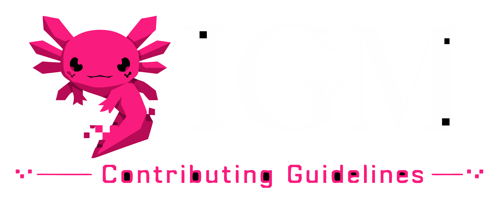

<div align="center">
  
</div>

# Contributing to IGM

First off, thank you for considering contributing to IGM (Instagram Terminal)! It's people like you that make this tool great.

## Code of Conduct

By participating in this project, you are expected to uphold our [Code of Conduct](CODE_OF_CONDUCT.md).

## How Can I Contribute?

### Reporting Bugs

This section guides you through submitting a bug report for IGM. Following these guidelines helps maintainers and the community understand your report, reproduce the behavior, and find related reports.

*   **Ensure the bug was not already reported** by searching on GitHub under Issues.
*   If you're unable to find an open issue addressing the problem, open a new one.
*   **Provide a clear and descriptive title** for the issue to identify the problem.
*   **Describe the exact steps** which reproduce the problem in as many details as possible.
*   **Provide specific examples** to demonstrate the steps. Include output snippets, especially any stack traces or error messages.

### Suggesting Enhancements

This section guides you through submitting an enhancement suggestion for IGM, including completely new features and minor improvements to existing functionality.

*   **Ensure the enhancement was not already suggested** by searching on GitHub under Issues.
*   If you're unable to find an open issue addressing the suggestion, open a new one.
*   **Provide a clear and descriptive title** for the issue to identify the suggestion.
*   **Provide a step-by-step description of the suggested enhancement** in as many details as possible.
*   **Explain why this enhancement would be useful** to most IGM users.

### Pull Requests

*   **Follow the existing code style.** IGM uses [Biome](https://biomejs.dev/) for linting and formatting. Run `npm run lint` or `npx biome check --write` before submitting your pull request.
*   **Ensure TypeScript compilation passes** without errors.
*   **Update the documentation** in the `docs/` directory if you are adding new features, CLI commands, or modifying core logic. The documentation must stay in sync with the codebase.
*   **Write commit messages** that are descriptive. We prefer the [Conventional Commits](https://www.conventionalcommits.org/) format (e.g., `feat: added new command`, `fix: resolved auth token issue`).

## Project Architecture

If you are contributing code, please refer to our comprehensive Developer Documentation in the `docs/` folder:

*   [**Architecture Overview**](docs/README.md) - Start here to understand the high-level design.
*   [**CLI Reference**](docs/cli.md) - Guide to `yargs` setup and command registration.
*   [**Core Engine**](docs/core.md) - The HTTP client, TLS impersonation, and anti-detection systems.
*   [**Domain Modules**](docs/modules.md) - Business logic (Identity, Timeline, Messaging, etc.).
*   [**IDMU Automation**](docs/automation.md) - The headless browser automation subsystem.

## Local Development Setup

1.  **Clone the repository**:
    ```bash
    git clone https://github.com/hopfian/igm.git
    cd igm
    ```
2.  **Install dependencies**:
    ```bash
    npm install
    ```
3.  **Run the CLI locally**:
    ```bash
    npm run build:exe
    ./igm.exe --help
    ```
    Or run via TypeScript directly:
    ```bash
    npx tsx src/cli/index.ts --help
    ```

Thank you for contributing to IGM!
