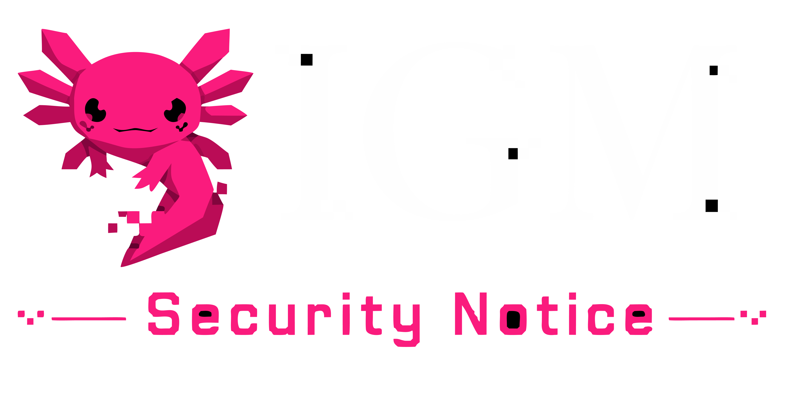

  

# Security Policy

## Supported Versions

Currently, only the latest release of IGM is actively supported for security updates. Since IGM relies on the undocumented and ever-changing private Instagram API, older versions may break unexpectedly or expose unintended security risks due to upstream API changes.

| Version | Supported          |
| ------- | ------------------ |
| v1.0.x  | :white_check_mark: |
| < v1.0  | :x:                |

## Reporting a Vulnerability

We take the security of IGM and its users very seriously. If you discover a security vulnerability within IGM, please **DO NOT** open a public issue.

Instead, please send an email to the project maintainers at **step-wizard-spill@duck.com** (or report it via a confidential GitHub Security Advisory).

Please include the following information in your report:

- Type of issue (e.g., buffer overflow, SQL injection, cross-site scripting, credential leak)
- Full paths of source file(s) related to the manifestation of the issue
- The location of the affected source code (tag/branch/commit or direct URL)
- Any special configuration required to reproduce the issue
- Step-by-step instructions to reproduce the issue
- Proof-of-concept or exploit code (if possible)
- Impact of the issue, including how an attacker might exploit the issue

We will endeavor to respond to your report within 48 hours. If the vulnerability is confirmed, we will issue a patch and a security advisory as soon as possible.

## Threat Model and Out of Scope

IGM is designed to run locally on a user's machine. The following are generally considered **out of scope** for security bounties/reports:

- Local privilege escalation (an attacker who already has local access to your machine can read the plaintext `cookies.txt` by design).
- Denial of Service (DoS) attacks requiring the user to run malicious commands.
- Issues related to Instagram's own infrastructure or rate-limiting bans. IGM employs anti-detection mechanisms, but account suspension by Meta is an accepted risk of using this software.
